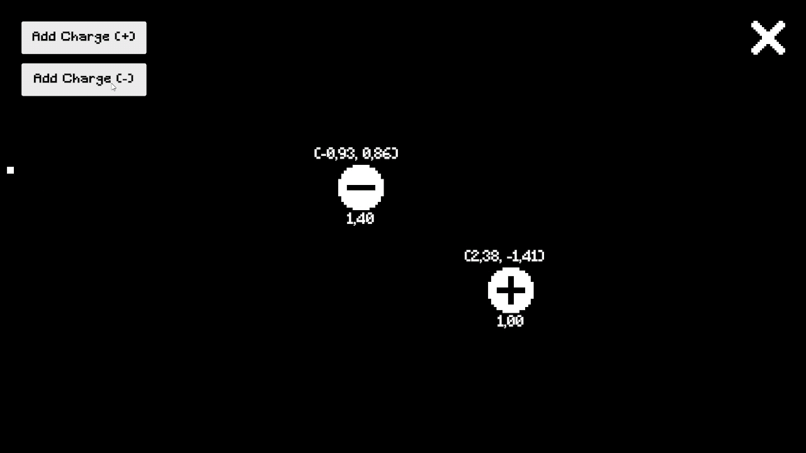

# Proyectos de Física Aplicada 

Este repositorio centraliza todos los trabajos, laboratorios y herramientas desarrollados para la asignatura de **Física Aplicada**. El objetivo es aplicar conceptos físicos mediante la programación para resolver problemas de cálculo y simulación.

## Tecnologías y Entorno
<p align="center">
  
  
  
</p>
Todos los proyectos de este repositorio están desarrollados utilizando:

- **Lenguaje:** C#
- **Framework:** .NET (v9.0.300)
- **Motor de simulación y visualización:** Unity

## Índice de Proyectos

A continuación, se listan los proyectos desarrollados durante el curso:

1. **Conversor de Prefijos del SI**  _(no publicado)_  
   - Herramienta de consola para convertir magnitudes utilizando notación científica (desde *quecto* hasta *quetta*).  
   - Generación de reportes automáticos en formato `.txt`.

2. **Series de Aproximación Exponencial y Análisis de Errores**  _(no publicado)_ 
   - Cálculo de aproximaciones de la función exponencial mediante series de potencia.  
   - Cómputo de error absoluto, relativo y porcentual frente al valor de referencia.  
   - Comparación de distintas órdenes de truncamiento y visualización del comportamiento del error.
   - Generación de reportes automáticos en formato `.txt`.

3. **Calculadora de Fuerza – Ley de Coulomb**  _(publicado + simulación en Unity)_  
   - Cálculo de la fuerza eléctrica entre dos o más cargas puntuales según la ley de Coulomb.
   - Cálculo del vector fuerza entre dos o más cargas puntuales.  
   - Permite configurar signo, magnitud y distancia de las cargas.
   - Generación de reportes automáticos en formato `.txt`.  
   - Incluye una simulación interactiva en Unity donde se visualizan las cargas, su valor y su posición vectorial.

   <details>
   <summary>Ver preview</summary>

   

   </details>

---

## Cómo ejecutar los proyectos

**Para proyectos publicados**
1. Ir a la pestaña **Releases** del repositorio en GitHub.
2. Buscar el release indicado en el índice de proyectos  
   (por ejemplo, para la Calculadora de Coulomb: tag `coulomb-sim-1.0.0`).
3. Descargar el archivo correspondiente a tu plataforma  
   (por ejemplo, `Coulomb_law_calculator.zip`).
4. Descomprimir el archivo descargado.
5. Ejecutar el archivo principal de la build:
   - (Ejemplo) En Windows: el `.exe` dentro de la carpeta descomprimida.

**Para proyectos no publicados**
1. Clonar el repositorio.
2. Navegar a la carpeta del proyecto específico: `cd NombreDelProyecto`.
3. Ejecutar el comando:

```bash
dotnet run
```
> Requisitos: Tener instalado el SDK de .NET (9.0 version o superior) para usar `dotnet run`.
> Puedes descargarlo desde la página oficial de Microsoft: [Descargar .NET SDK](https://dotnet.microsoft.com/download)

---

## Cómo ejecutar las simulaciones en Unity (desde Releases)

Algunos proyectos incluyen una build de Unity lista para usar, publicada en la sección **Releases** del repositorio.

1. Ir a la pestaña **Releases** del repositorio en GitHub.
2. Buscar el release indicado en el índice de proyectos  
   (por ejemplo, para la Calculadora de Coulomb: tag `coulomb-sim-1.0.0`).
3. Descargar el archivo correspondiente a tu plataforma  
   (por ejemplo, `Coulomb_law_simulation_build.zip`).
4. Descomprimir el archivo descargado.
5. Ejecutar el archivo principal de la build:
   - (Ejemplo) En Windows: el `.exe` dentro de la carpeta descomprimida.

Si un proyecto indica que **incluye simulación en Unity**, su build estará siempre disponible en la sección **Releases**, identificada por el tag mencionado junto al proyecto en el índice.
